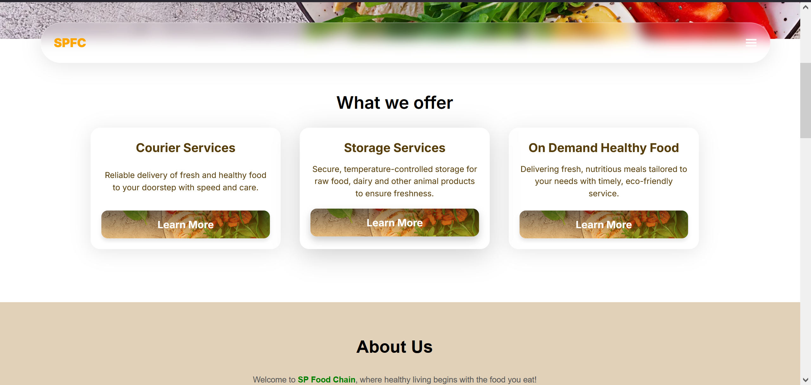

# 🍔 SP Food Chain

A modern food delivery frontend sample built with **Next.js**, **Tailwind CSS**, and **AOS** for smooth animations.  
This project demonstrates a responsive and visually appealing food chain/grocery delivery website.

---

## ✨ Features
- 🚀 Built with [Next.js 14](https://nextjs.org/)
- 🎨 Styled using [Tailwind CSS](https://tailwindcss.com/)
- 💫 Smooth animations with [AOS](https://michalsnik.github.io/aos/) & [Animate.css](https://animate.style/)
- 📱 Fully responsive design for all devices
- 🛒 Clean UI for food delivery/grocery services

---

## 📸 Screenshot


---

## 🛠️ Installation

Clone the repository:

```bash
git clone https://github.com/IsraelIyke/spfoodchain.git
cd spfoodchain
```

Install dependencies:
```npm install```

Run development server:
```npm run dev```

---

## 📂 Tech Stack
- Framework: Next.js 14
- Styling: Tailwind CSS
- Animations: AOS, Animate.css
- Icons: React Icons

---

🤝 Contributing

Contributions are welcome! Feel free to open issues or submit pull requests.
